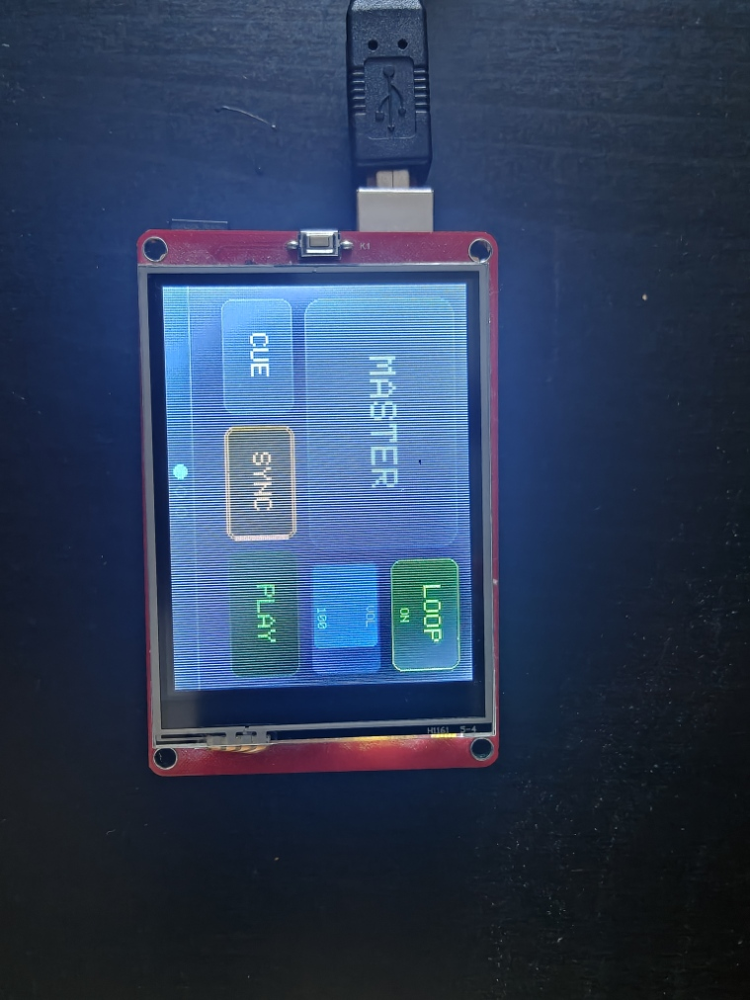
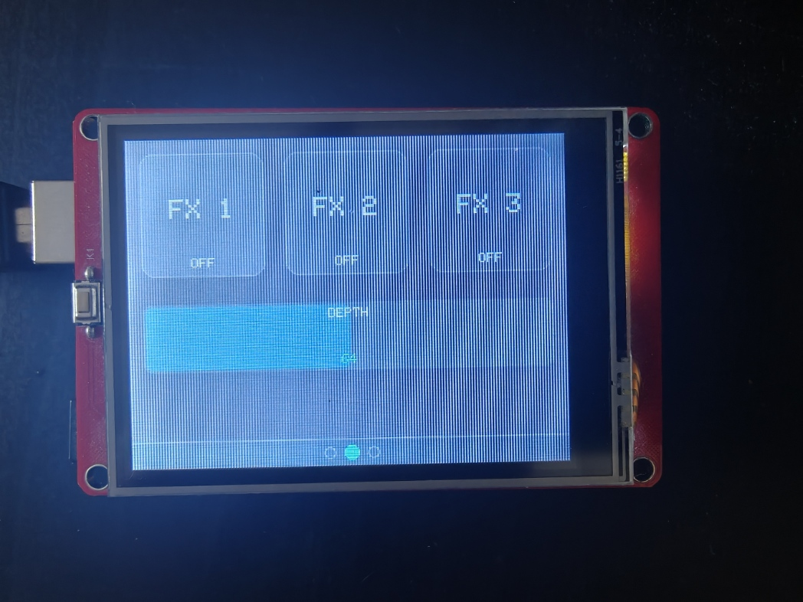

# Touchscreen DJ controller
AI was used in making this project.

Note this is a work in progress. It might not fully work at the moment. Any existing features might change without any previous notice. Want something in particular or a bug? Feel free to open a pull request.




The colors are customizable!

## What it is?
It is a touchscreen midi controller for DJing using an Arduino and a touchscreen. You can make custom layouts with buttons, sliders, and supports pagination. You can specify the midi code of them. The layout file can be easily shared. This was primarly made for DJing, but nothing stops you from using it for any program accepting midi. Also it is open source! You can adapt it to any of your needs.

## How it works
You write a json config on how you want your layout and specify the midi codes they send. The Generate.py program will take care of generating an arduino sketch, then flash.py can take care of flashing it directly to your Arduino. Arduino uno does not supports midi, so you must use [The Hairless MIDI bridge](https://projectgus.github.io/hairless-midiserial/) to receive the MIDI messages. On Mac you can use the MIDI setup utility to create loopback midi ports, for windows you may use [loopMIDI](https://www.tobias-erichsen.de/software/loopmidi.html) or any other program.

```
my_layout.json  →  generate.py  →  firmware.ino  →  flash.py  →  Arduino
```

## Supported devices
- Arduino uno
- Tested with a Keyes 2.8"TFT LCD Shield
   - Note at the moment it uses the MCUFRIEND_kbv library. Support for other screens is unknown. Check if your display is supported by that library, and if you need to do any changes (pull request? 👀).

## Files

| File                | Purpose                                              |
|---------------------|------------------------------------------------------|
| `my_layout.json`    | Your controller layout (edit this)                   |
| `generate.py`       | Converts JSON → Arduino .ino sketch                  |
| `flash.py`          | Generates + compiles + uploads in one command        |
| `CONFIG_FORMAT.md`  | Full documentation of every config option            |

---

## Quick start

### 1. Install arduino-cli (one time)

Download from https://arduino.github.io/arduino-cli/latest/installation/

Then run these once to install the board core and libraries:

```bash
arduino-cli core update-indexarduino-cli core update-index
arduino-cli core install arduino:avr
arduino-cli lib install "MCUFRIEND_kbv" "Adafruit GFX Library" "TouchScreen"
```

### 2. Edit your layout
See [CONFIG_FORMAT.md](CONFIG_FORMAT.md) for the documentation of the layout JSON format.

Open `my_layout.json` and edit it. See `CONFIG_FORMAT.md` for every option.

**To flip the screen 180°:** change `"rotation": 1` to `"rotation": 3` in the
`device.screen` block.

**To change MIDI channel:** change `"channel": 1` in `device.midi`.

### 3. Flash

```bash
# Auto-detect Arduino port and flash
python flash.py --config my_layout.json

# Specify port manually
python flash.py --config my_layout.json --port COM3           # Windows
python flash.py --config my_layout.json --port /dev/cu.usbmodem14101  # Mac

# Just generate the .ino without flashing (useful for inspecting)
python flash.py --config my_layout.json --generate-only

# List connected Arduino boards
python flash.py --list-ports
```

The generated sketch is saved to `firmware/<config_name>/firmware.ino`.

---

## Calibrate touch (first time or after changing rotation)

1. Open `firmware/<name>/firmware.ino` in Arduino IDE
2. Change `#define CALIBRATE_MODE 0` to `1`
3. Upload, open Serial Monitor at 115200 baud
4. Tap each corner crosshair when prompted
5. Copy the four numbers back into your JSON config under `device.touch`
6. Regenerate and flash: `python flash.py --config my_layout.json`

---

## Control types

### Button (momentary)
Sends a CC value on press. Optionally sends 0 on release (`send_release: true`).
Can receive feedback from the PC to light up without being pressed.

### Toggle (latching)
Tap once → ON (sends `value_on`). Tap again → OFF (sends `value_off`).
State is kept on the Arduino.

### Slider
Drag to send CC values from `value_min` to `value_max`.
Supports `horizontal` or `vertical` orientation.
Can receive feedback from the PC to update its position.

---

## MIDI bridge setup

The Arduino Uno has no USB-MIDI. Use Hairless MIDI to bridge:

1. **Windows:** install loopMIDI → create a port named `Arduino MIDI`
   **Mac:** Audio MIDI Setup → IAC Driver → add a bus named `Arduino MIDI`

2. Open Hairless MIDI:
   - Serial port: your Arduino COM/USB port
   - MIDI out: `Arduino MIDI`
   - MIDI in: `Arduino MIDI` (for feedback from your DAW)
   - Edit → Preferences → Baud rate: **31250**

3. Connect in Hairless, then open VirtualDJ (or any DAW) and map
   `Arduino MIDI` as a controller device.

> ⚠️ Close Hairless MIDI before flashing. They share the serial port.

## Future ideas

- Visual GUI editor to edit the JSON configuration
- Proper midi in support to sync the state of the screen to the DJ program
- Arduino Leonardo support as it natively supports MIDI trough USB